# 调试Android的Webview

对于Chrome来说，除了在电脑上用其调试网页，包括适配了移动端的H5页面，比如：

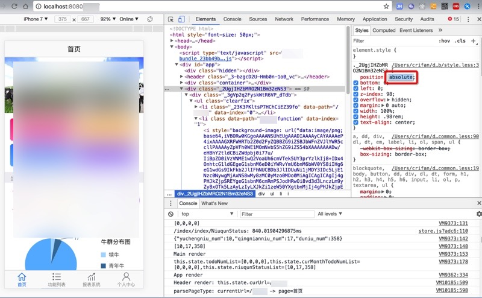

还可以用其来调试手机端的H5页面。

## 用Chrome在电脑端调试手机端APP内的Webview页面

比如在Mac上，也当然先要把Android的手机用USB数据线连接到电脑上：

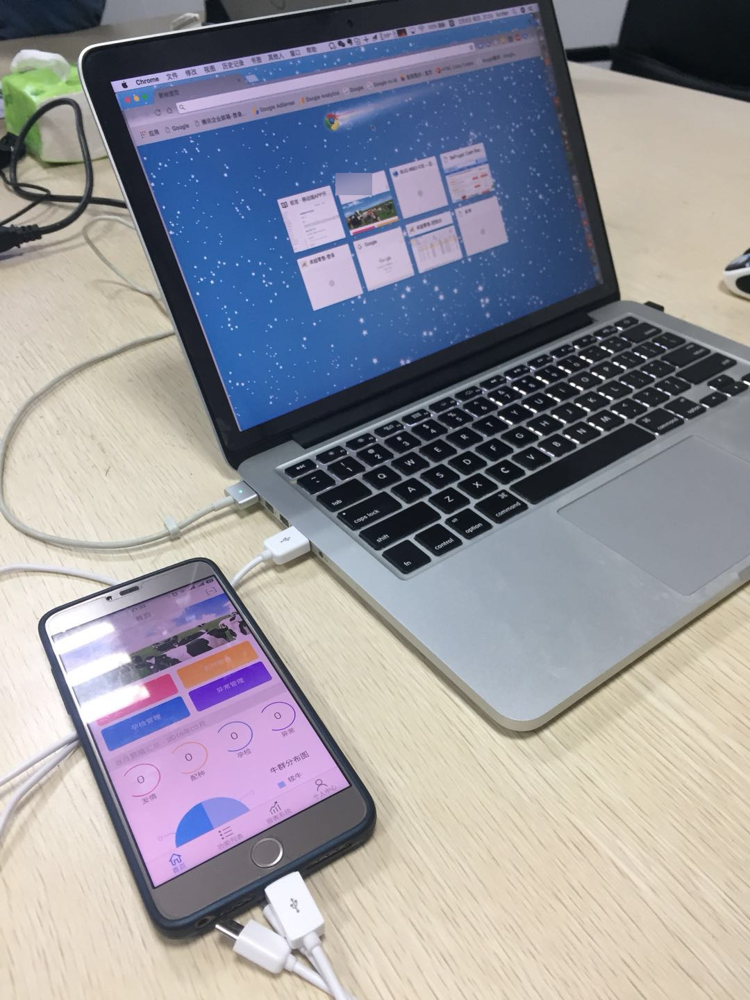

然后先确保Android端打开你要调试的APP，把对应的包含了网页的界面打开，其内部是调用了Webview的内核打开的页面，比如：

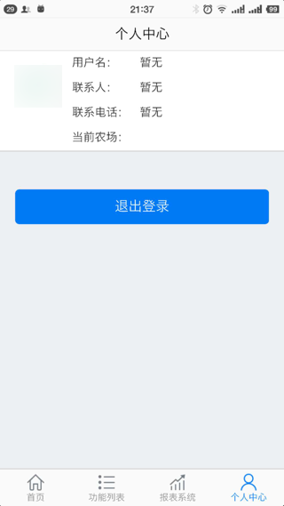

然后去Mac中，打开：

`Chrome` -> `更多工具` -> `开发者工具`：

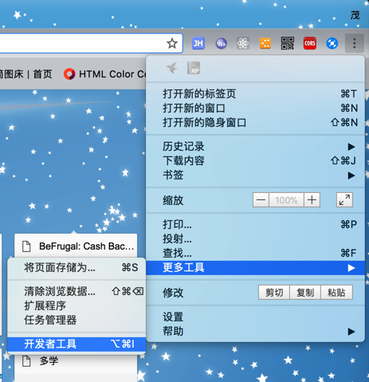

 然后即可打开调试页面：

 然后对于打开远程设备去调试页面，有两种方式：

### chrome://inspect中找到远程Android设备 
直接Chrome中输入：

`chrome://inspect`

即可看到已插入电脑的Android手机中的App，包含对应的页面

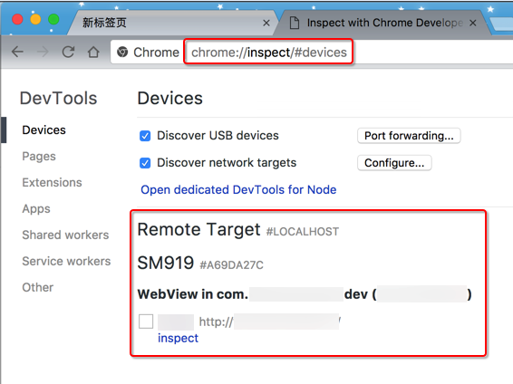

点击`Inspect`即可开始调试。

### console栏中Remote Devices

在开发者工具的Console栏中，点击三个点：

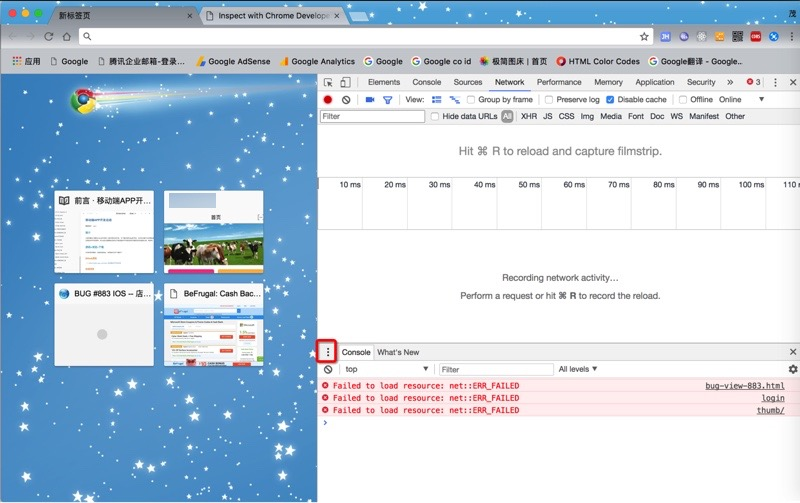

然后选择`Remote devices`：

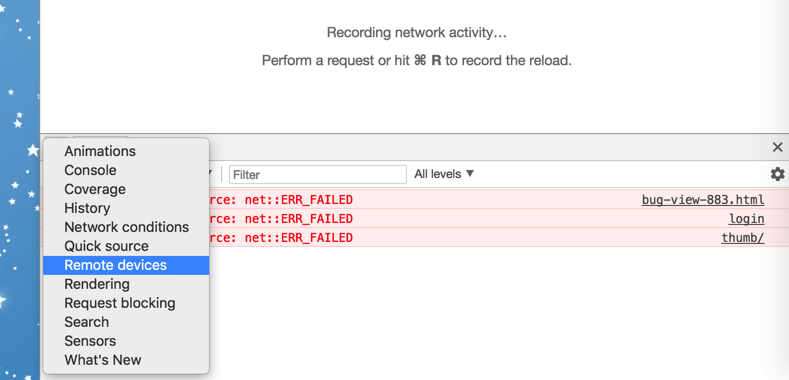

然后，如果本身Android手机已经插入电脑了，则就可以看到：`xxx Connected`，比如此处的`SM919 Connected`：

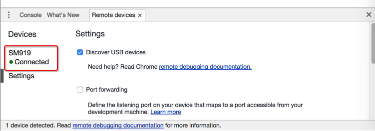

其中`SM919`是锥子M1L的内部设备编号。

点击了connected的Android设备后，即可看到对应的设备和页面，点击`Inspect`：

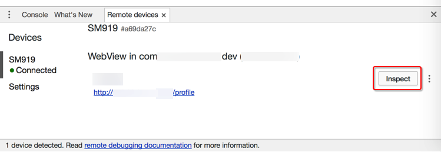

即可去进去调试页面：

可以鼠标移动到html的元素，以便于查看详细参数，看看是否符合期望：

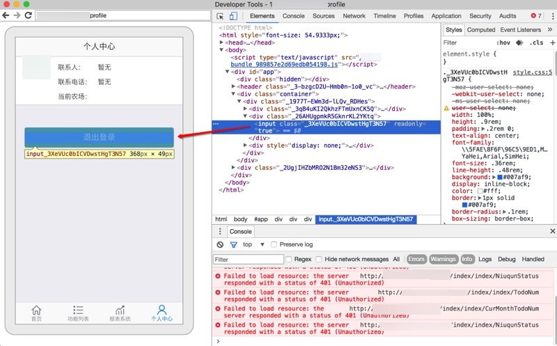

且调试效果是实时的：

* 当手机端切换页面时，PC端的页面内容也会立刻刷新
  * 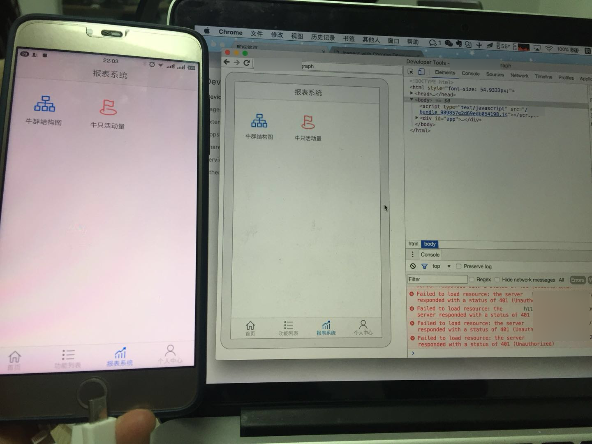
* 当此APP被切换到后台时，对应的页面会显示Inactive，表示处于没有激活的状态：
  * 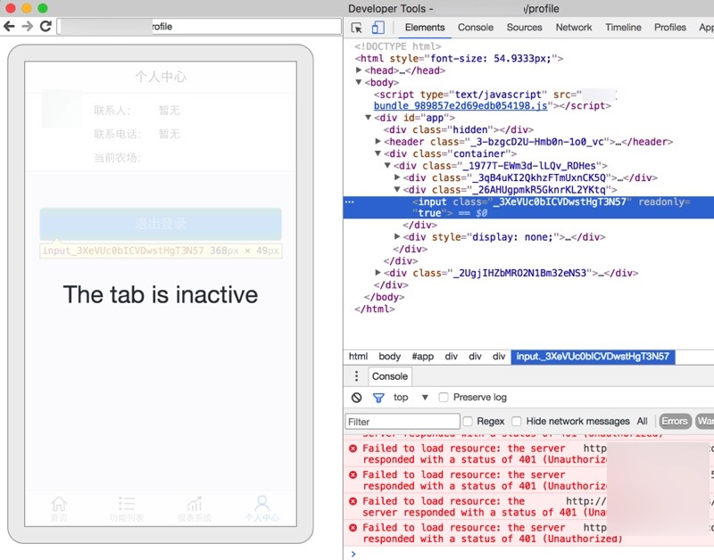

如此，就可以愉快的，在电脑端(Windows/Mac)去调试(通过数据线连接到电脑的)远程Android手机端的APP内部的网页（内部是基于Webview的页面）了。