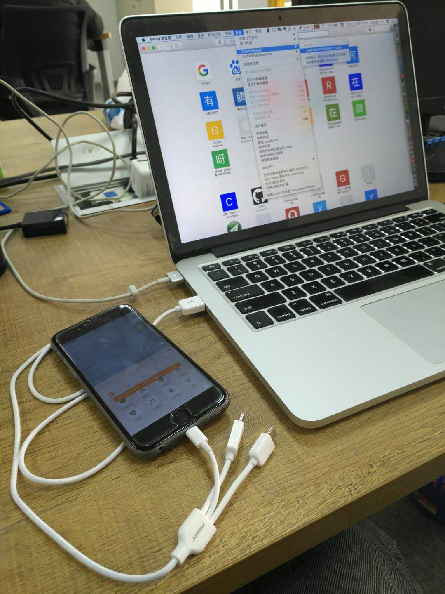
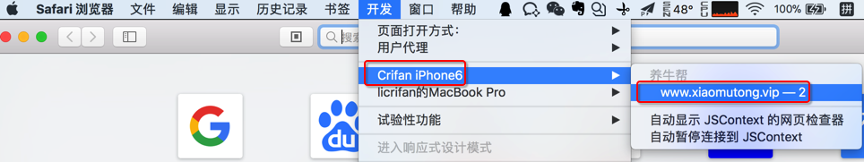
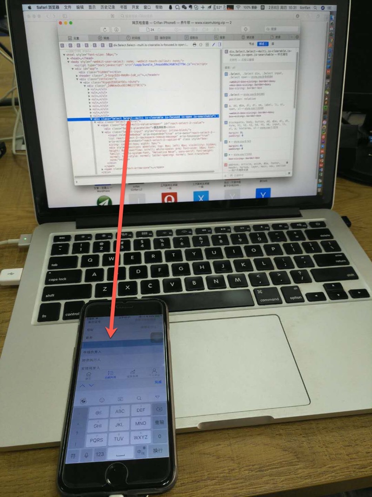
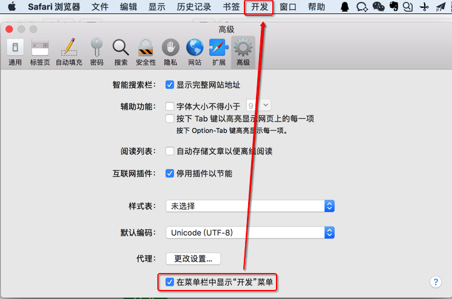

# 调试iOS的Webview

把iOS设备，比如iPhone手机连接到Mac上之后:

打开Mac中的Safari浏览器，在已经开启开发模式（显示出开发菜单）后，可以在：

`开发` -> `xxx iPhone` -> 选择对应的页面：

即可去调试手机移动端中的（WebKit内核的）页面。鼠标移动到对应的html的元素上之后，手机端的页面的对应部分即可实时显示出背景色了：

## Safari中显示`开发`菜单

`Safari` -> `配置` -> 勾选`在菜单中显示"开发"菜单` -> 菜单中就可以看到`开发`菜单了：

