# iOS消息推送

iOS中的消息推送，相对来说，比较特殊一点。

因为iOS中的消息推送，首先是从你的消息推送服务器，发送到苹果官网的服务器，叫做APNS，然后再发送到你的iOS设备，比如iPhone，中的。

也因此，消息推送的时间，往往没法完全的保证，因为还要取决于APNS到你的iPhone的手机中的推送时间，虽然多数情况下较快，但是也还是有时候会比较慢的。

## iOS的消息推送证书

iOS的app要支持消息推送的话，需要：

* （Xcode中）设置APP支持消息推送
* 申请相关的消息推送的证书
* 在消息推送服务器（比如JPush的后台管理页面）中（上传）配置对应的推送证书

且需要注意的是，iOS的消息推送证书分两种：

* 开发环境的消息推送证书：用于平时开发调试期间使用
* 正式（生产）环境的消息推送证书：用于生产环境，已上线的APP使用
  * 理论上来说：生产环境的消息推送证书，在你创建到时候，就提示了，其实也可以被用于开发环境
    * 只不过平时还是很少混用，以免开发环境推送的消息影响到线上的环境

## 生成消息推送所需证书:`.p12`文件

对于想要去申请获得消息推送所需的证书，简要概括步骤是：

* 登录苹果开发者网站后台管理页面
* 选择是Develop开发环境还是Production生产环境
* 选择APP ID
* 创建和上传CSR文件
* 生成`.cer`证书文件
* 用Mac中的`钥匙串`打开`.cer`证书文件
* 导出为`.p12`推送证书文件
  * 期间需要设置证书的密码，记得保存好，以后万一给别人使用时，需要密码才能用

详细步骤如下：

### 登录苹果开发者网站后台管理页面

进入：[苹果开发者 后台管理页面](https://developer.apple.com/account/)

会自动跳转到：

Sign in with your Apple ID - Apple Developer

https://idmsa.apple.com/xxx

之类的地址，输入Apple ID和密码即可登录

### 选择是Develop开发环境还是Production生产环境

点击Certificates右上角的加号+：

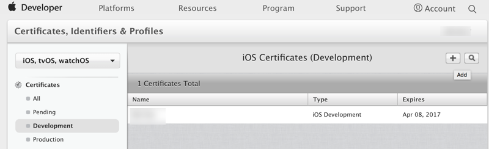

然后选择对应的环境：

* 开发环境：选择 `Development` -> `Apple Push Notification service SSL (Sandbox)`
  * 用于平时在开发环境测试消息推送使用
* 生产环境：选择 `Production` -> `Apple Push Notification service SSL (Sandbox & Production)`
  * 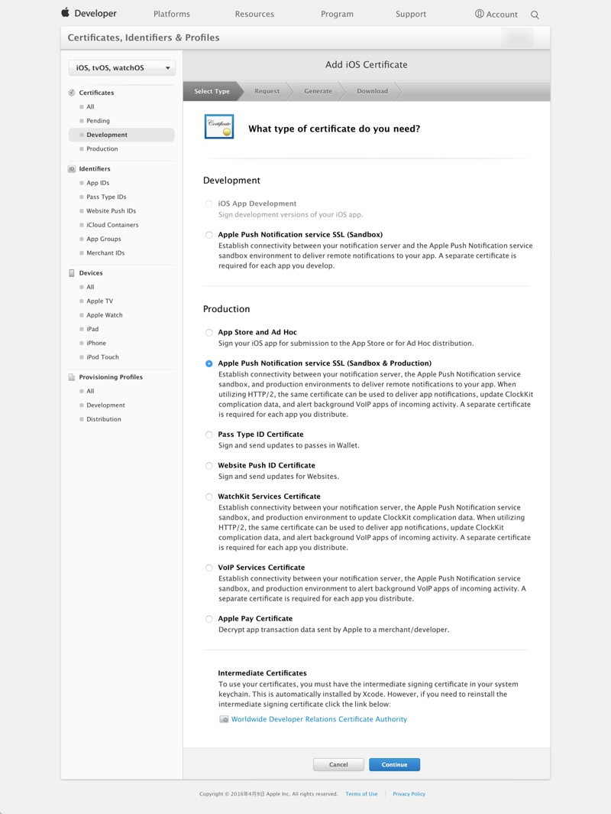

### 选择对应的APP ID

然后选择对应的APP ID：

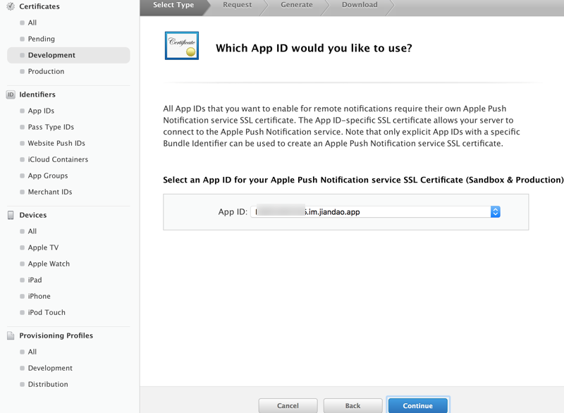

表示这个消息推送证书是给哪个APP用的。

### 创建和选择CSR文件

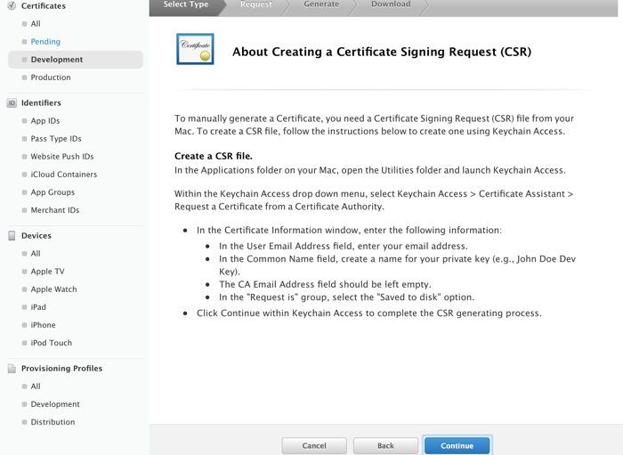

点击Continue继续：

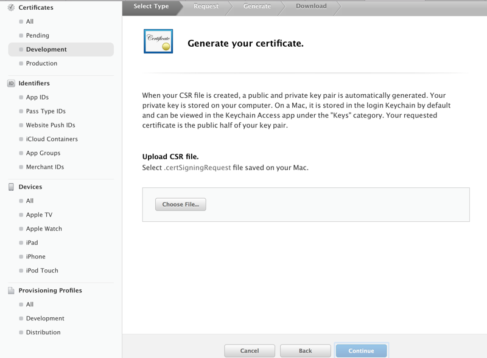

然后选择之前创建好的CSR文件：

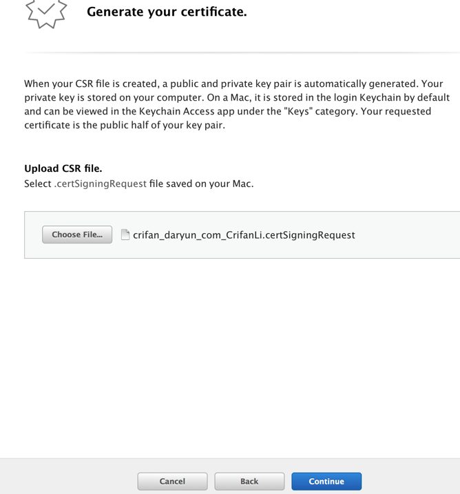

然后即可成功创建对应的证书：

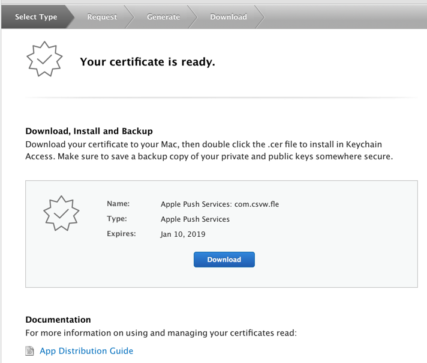

然后可以点击下载得到`.cer`文件：

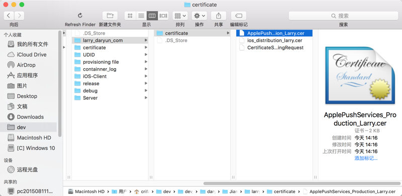

#### Mac中创建CSR文件

如果没有CSR文件，则去Mac中创建：

去Mac中打开`钥匙串`，然后:

`钥匙串访问` -> `证书助理` -> `从证书颁发机构请求证书`：

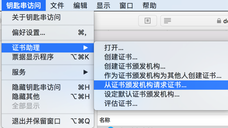

继续去在证书助理中，填写信息：

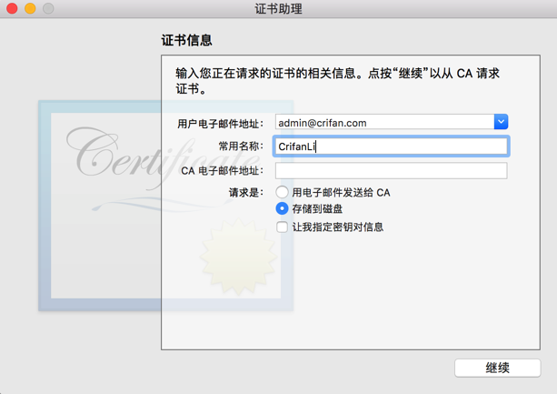

然后继续，就可以创建成功了：

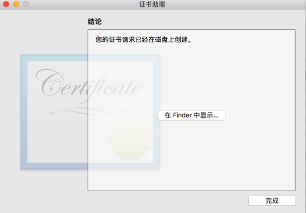

然后找到刚创建好的`.certSigningRequest`文件，比如`crifan_daryun_com_CrifanLi.certSigningRequest`

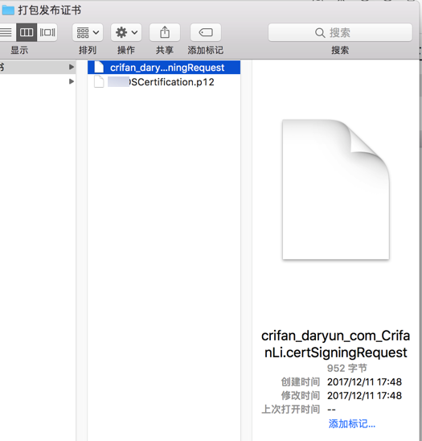

### 用钥匙串把`.cer`证书转换导出为`.p12`消息推送证书文件

Mac中用`钥匙串访问`打开`.cer`文件：

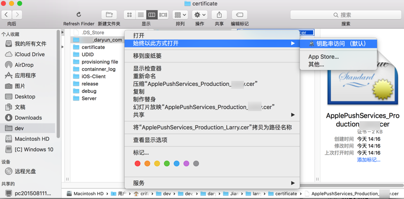

然后右击该证书，选择`导出xxxx`：

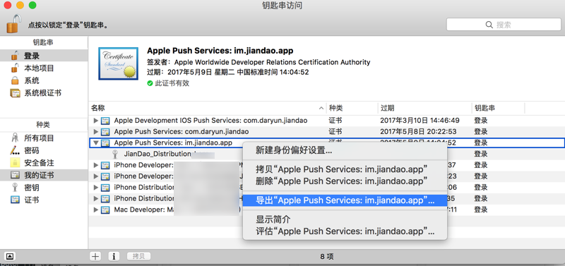

即可去导出`.p12`文件:

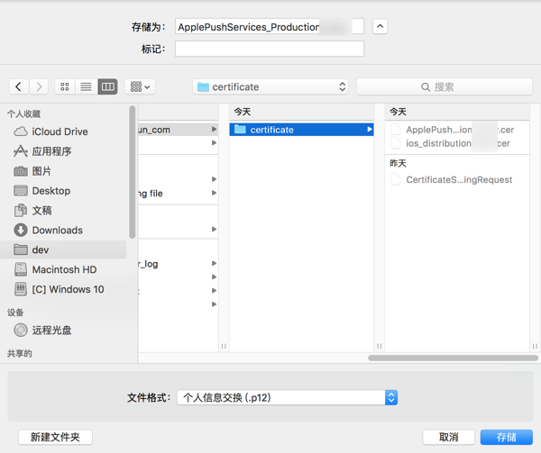

导出时需要设置密码:

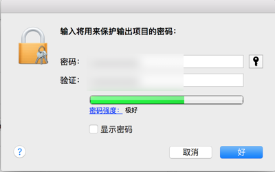

然后即可得到消息推送所需要的`p12`证书文件：

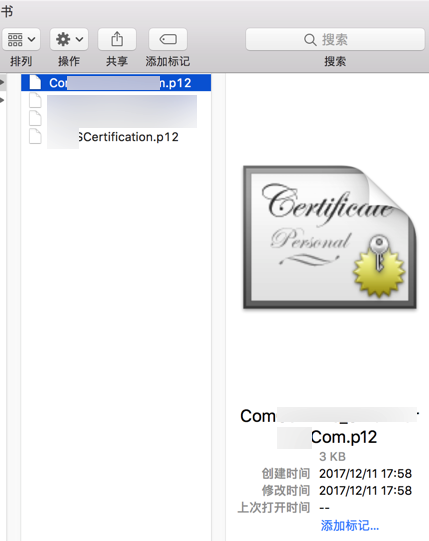
