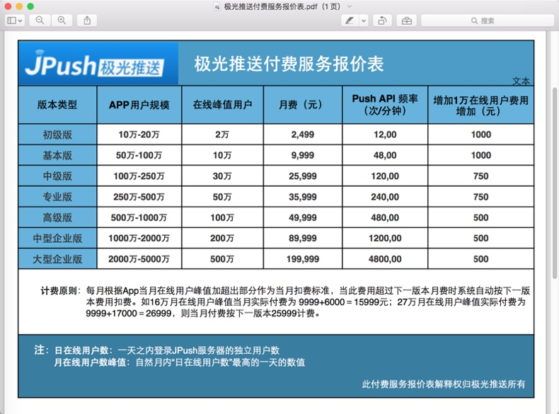
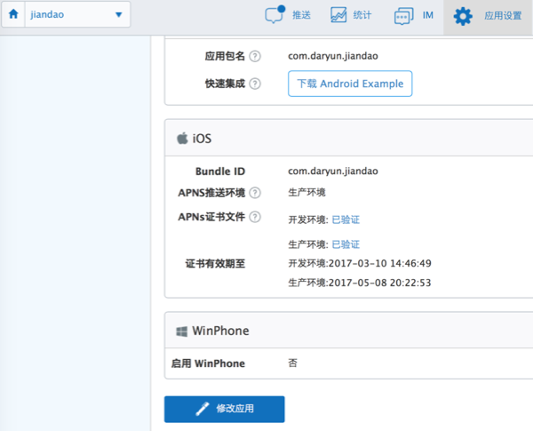
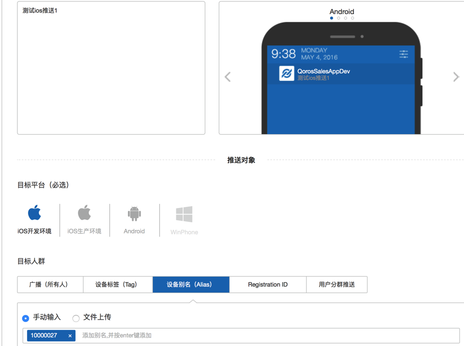
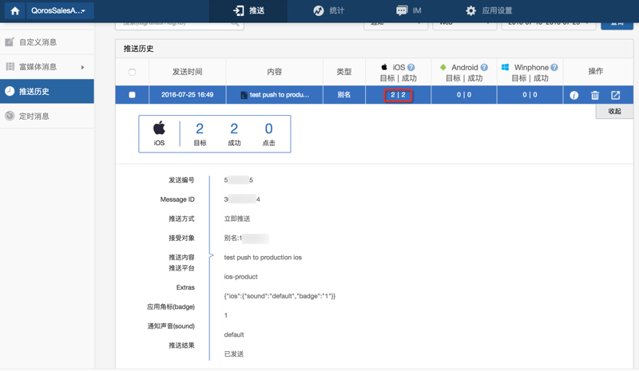
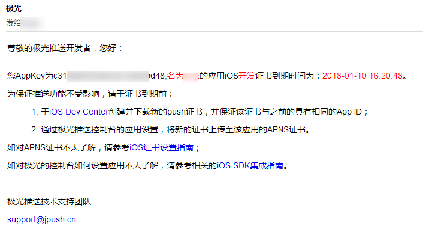

# 极光推送JPush

`极光推送`=`JPush`

主页：[首页 - 极光｜数据改变世界](https://www.jiguang.cn)

## 极光推送的价格

默认是有免费的服务使用的。限制是：所有的使用免费的极光推送的APP去共享使用20万/秒的服务。

* -> 换句话说：如果你的APP的消息推送正好赶上其他所有的免费的APP使用极光的服务的高峰期，则消息推送可能会稍微延迟一段时间。
  * 其实一般情况下，多数情况下，延迟也还是很低的，总体的感觉是80%以上的时间，服务器端消息推送后，APP端收到消息的延迟，都是在1秒～5秒，足够一般的APP使用了，不会觉得多慢的
* -> 换另外一句话说：如果真的是你的APP对于消息推送的推送的及时率有很高的要求，那么就应该去购买收费的极光推送的服务了
  * 收费的激光服务的价格：最少每月也要2000多元
    * 所以收费服务，对于小公司，还是挺贵的
    * 所以对于一般的APP来说，如前面所说的极光的免费的消息推送的服务，也就够用了，不需要额外花钱买收费的

另外，对于APP用户规模大的，需要购买收费的极光的服务的，附上价格表，供参考：



## 极光推送消息基本知识

### iOS的证书

iOS的消息推送，支持开发环境和测试环境。

需要分别去上传对应的证书才可以的。



## 标签tag和别名Alias

可以通过tag或alias，去实现，给某类用户设置同一个tag或alias，然后消息推送的时候，给同一类的用户批量推送相同的消息。

比如，牛只管理app中，对于牛只的管理员，当发生异常信息，比如牛只设备掉落时，给所有的同一组的管理员，都发送预警消息。

另外一个典型的使用方式是：

比如对于一个APP，内部有一套自己的用户系统，其中每个用户有自己的userid，比如类似于UUID的这种：`user-39ee1299-4e29-43cf-904f-d8826ce1b899`

而如果移动端想要实现接收到服务器推送不同的消息给每个用户，其中一种实现方式就是：

每个用户都设置一个，借用userid的独一无二的别名，比如：

`user-39ee1299-4e29-43cf-904f-d8826ce1b899`

后续服务器端给每个用户推送消息时，就直接给对应别名去推送消息，对应的用户即可收到对应的消息推送了。

其中几点需要说明的是：

* APP中用户登录后，APP初始化时（在init初始化JPush的API后）去注册register对应的自己用户ID对应的别名alias
  * 符合正常的逻辑：用户登录后，应该能收到消息推送
* APP中用户退出登录时，去注销对应的JPush的对应的别名
  * 这样后续该用户就不会收到消息提醒了
  * 符合正常的逻辑：用户注销后，不应该继续收到消息推送

## JPush的服务不错

### 后台管理页面中可以方便测试消息推送

可以方便的去测试消息发送

支持对于：

* iOS
  * 生产环境
  * 测试环境
* Android

还可以指定发送对象

* 具体的某个设备
* 某个tag
* 某个alias
* 广播所有设备

等等。

截图供参考：



推送后，可以方便的看到推送的结果：



### iOS证书将要过期会及时提醒

极光推送在证书快要过期前一个月会发邮件通知管理员的，需要你及时去更新证书：



然后去Apple的开发者网站[Apple Developer](https://developer.apple.com)中去：

* 撤销旧证书
* 重新生成新证书
* 重新到JPush后台上传新证书

即可。

### iOS中JPush相关示例代码

此处附上之前的iOS的app：**简道**中的JPush的消息推送的iOS端的相关代码，供参考：

#### APP初始化部分的JPush相关配置

文件：`AppDelegate.swift`

代码：

```swift
let JpushAppKey:String      = "54abxxxxxxxxxx47"
let JpushChannel:String     = "iOS-AppStore"
//let JpushIsProduction:Bool  = false
let JpushIsProduction:Bool  = true

    func application(application: UIApplication, didFinishLaunchingWithOptions launchOptions: [NSObject: AnyObject]?) -> Bool {
        gLog.debug("didFinishLaunchingWithOptions launchOptions=\(launchOptions)")

        //1.reggister device
        JPUSHService.registerForRemoteNotificationTypes(UIUserNotificationType.Badge.rawValue | UIUserNotificationType.Sound.rawValue | UIUserNotificationType.Alert.rawValue , categories: nil)
        JPUSHService.setupWithOption(launchOptions, appKey: JpushAppKey, channel: JpushChannel, apsForProduction: JpushIsProduction)
        listenRemotePush()

        return true
    }

    func application(application: UIApplication, didRegisterForRemoteNotificationsWithDeviceToken deviceToken: NSData) {
        //2.recevie device token for register
        gLog.debug("deviceToken=\(deviceToken)")
        //deviceToken=<77366f0d c4a4f2f4 74fe24de 5db46132 c725ee1a 8e41b1fc a9a511bc 832c0113>
        NSNotificationCenter.defaultCenter().postNotificationName("DidRegisterRemoteNotification", object: deviceToken)
        //3. send device token to push server
        JPUSHService.registerDeviceToken(deviceToken)
    }
    

    func application(application: UIApplication, didFailToRegisterForRemoteNotificationsWithError error: NSError) {
        gLog.debug("error=\(error.localizedDescription)")
    }
    
//    //for iOS <= 6.0
//    func application(application: UIApplication, didReceiveRemoteNotification userInfo: [NSObject : AnyObject]) {
//        //4. receive the remote push message from (APNS -> JPUSH) server
//        print("didReceiveRemoteNotification")
//        print("userInfo=\(userInfo)")
//        JPUSHService.handleRemoteNotification(userInfo)
//        NSNotificationCenter.defaultCenter().postNotificationName("AddNotificationCount", object: nil)
//    }

    //for iOS >= 7.0
    func application(application: UIApplication, didReceiveRemoteNotification userInfo: [NSObject : AnyObject], fetchCompletionHandler completionHandler: (UIBackgroundFetchResult) -> Void) {
        gLog.debug("userInfo=\(userInfo)")
        JPUSHService.handleRemoteNotification(userInfo)
//        NSNotificationCenter.defaultCenter().postNotificationName("AddNotificationCount", object: nil)
        NSNotificationCenter.defaultCenter().postNotificationName("handleRemoteNotification", object: userInfo)
        completionHandler(UIBackgroundFetchResult.NewData)
    }
    
    func application(application: UIApplication, didReceiveLocalNotification notification: UILocalNotification) {
        gLog.debug("notification=\(notification)")
        
        //notification=<UIConcreteLocalNotification: 0x15f158b60>{fire date = 2016年3月11日 星期五 中国标准时间 16:33:53, time zone = Asia/Shanghai (GMT+8) offset 28800, repeat interval = 0, repeat count = UILocalNotificationInfiniteRepeatCount, next fire date = (null), user info = (null)}
        JPUSHService.showLocalNotificationAtFront(notification, identifierKey: nil)
        
//        if let userInfo = notification.userInfo {
//            let newMessage = userInfo["newMessage"] as! Message
//            debugPrintMsg(newMessage)
//        }
    }
    
    @available(iOS 7, *)
    func application(application: UIApplication, didRegisterUserNotificationSettings notificationSettings: UIUserNotificationSettings) {
        gLog.debug("notificationSettings=\(notificationSettings)")
        //notificationSettings=<UIUserNotificationSettings: 0x79070130; types: (UIUserNotificationTypeAlert UIUserNotificationTypeBadge UIUserNotificationTypeSound);>
        /*
        notificationSettings=<UIUserNotificationSettings: 0x12e6529a0; types: (UIUserNotificationTypeAlert UIUserNotificationTypeBadge UIUserNotificationTypeSound);>
        2016-03-11 16:22:05.110 | JPUSH | W - [JPUSHClientController] Not get deviceToken yet. Maybe: your certificate not configured APNs? or current network is not so good so APNs registration failed?  or there is no APNs register code? Please refer to JPush docs.
        
        2016-03-11 16:22:05.113 | JPUSH | I - [JPUSHSessionController] sis is not on protect
        2016-03-11 16:22:05.116 | JPUSH | I - [JPUSHAddressController] Action - sendSisRequest
        */
    }
    
    @available(iOS 7, *)
    func application(application: UIApplication, handleActionWithIdentifier identifier: String?, forLocalNotification notification: UILocalNotification, completionHandler: () -> Void) {
        gLog.debug("handleActionWithIdentifier=\(identifier), forLocalNotification=\(notification)")
    }
    
    @available(iOS 7, *)
    func application(application: UIApplication, handleActionWithIdentifier identifier: String?, forRemoteNotification userInfo: [NSObject : AnyObject], withResponseInfo responseInfo: [NSObject : AnyObject], completionHandler: () -> Void) {
        gLog.debug("handleActionWithIdentifier=\(identifier), forRemoteNotification=\(userInfo), withResponseInfo=\(responseInfo)")
    }

    func networkDidLogin(notification:NSNotification) {
        gLog.debug("已登陆 networkDidLogin notification=\(notification)")
        
        if let registrationID = JPUSHService.registrationID() {
            gLog.debug("registrationID=\(registrationID)")
        }
    }


    func listenRemotePush(){
        gLog.debug("")
        let defaultCenter:NSNotificationCenter = NSNotificationCenter.defaultCenter()
        defaultCenter.addObserver(self, selector: #selector(AppDelegate.networkDidSetup(_:)), name:kJPFNetworkDidSetupNotification, object: nil)
        defaultCenter.addObserver(self, selector: #selector(AppDelegate.networkDidClose(_:)), name:kJPFNetworkDidCloseNotification, object: nil)
        defaultCenter.addObserver(self, selector: #selector(AppDelegate.networkDidRegister(_:)), name:kJPFNetworkDidRegisterNotification, object: nil)
        defaultCenter.addObserver(self, selector: #selector(AppDelegate.networkDidLogin(_:)), name:kJPFNetworkDidLoginNotification, object: nil)
        defaultCenter.addObserver(self, selector: #selector(AppDelegate.networkDidReceiveMessage(_:)), name:kJPFNetworkDidReceiveMessageNotification, object: nil)
        defaultCenter.addObserver(self, selector: #selector(AppDelegate.serviceError(_:)), name:kJPFServiceErrorNotification, object: nil)
        
        defaultCenter.addObserver(self, selector: #selector(AppDelegate.didRegisterRemoteNotification(_:)), name:"DidRegisterRemoteNotification", object: nil)
        
        defaultCenter.addObserver(self, selector: #selector(AppDelegate.handleRemoteNotification(_:)), name:"handleRemoteNotification", object: nil)
    }

    func handleRemoteNotification(remoteNotification:NSNotification) {
        gLog.debug("remoteNotification=\(remoteNotification)")
        if let userInfoDict = remoteNotification.object {
            gLog.debug("userInfoDict=\(userInfoDict)")

            if let aps = userInfoDict["aps"] {
                if let badge = aps?["badge"] as? Int {
                    gLog.debug("badge=\(badge)")
                    UIApplication.sharedApplication().applicationIconBadgeNumber = badge
                }
            }
            
            if UIApplication.sharedApplication().applicationState == UIApplicationState.Active {
                gLog.debug("not handle remote notification for app is active running")
            } else {
                gLog.debug("applicationState=\(UIApplication.sharedApplication().applicationState)")

                SingletonConversationTVC().updateAllConversation()
            }
        }
    }
```

#### 登录后去初始化调用

文件：`LoginViewController.swift`

代码：

```swift
    func doAfterLogin(){
        dispatchBackground_async({
            //init message related
            SingletonMainVC().initWebSocket()
...
        })
    }
```

文件：`MainViewController.swift`

代码：

```swift
    func jpushSetAlias() {
        gLog.debug("")
        var userIdAlias = gCurUserItem.id
        userIdAlias = userIdAlias.replace("user-", to: "usr-")
        userIdAlias = userIdAlias.replace("-", to: "_")
        gLog.debug("userIdAlias=\(userIdAlias)")
        //user-e6882cab-cedf-4335-9b7c-612cd5b4d37d
        //usr_e6882cab_cedf_4335_9b7c_612cd5b4d37d

        jpushSetAlias(userIdAlias)
    }
    
    func jpushSetAlias(userIdAlias:String) {
        gLog.debug("userIdAlias=\(userIdAlias)")

        JPUSHService.setAlias(userIdAlias, callbackSelector: #selector(MainViewController.aliasCallBack(_:tags:alias:)), object: self)
    }
    
    func jpushClearAlias() {
        gLog.debug("")
        jpushSetAlias("")
    }
    
    func aliasCallBack(resCode:CInt, tags:NSSet, alias:NSString) {
        gLog.debug("resCode=\(resCode), tags=\(self.logSet(tags)), alias=\(alias)")
        //resCode=6004, tags=nil, alias=user-e6882cab-cedf-4335-9b7c-612cd5b4d37d
        //resCode=6003, tags=nil, alias=e6882cab-cedf-4335-9b7c-612cd5b4d37d
        //resCode=0, tags=nil, alias=usr_e6882cab_cedf_4335_9b7c_612cd5b4d37d
        if resCode != 0 {
                let failMsg = "设置JPUSH推送的别名失败：alias=\(alias)"
                gLog.warning(failMsg)
        }
    }

    func initWebSocket(){
        dispatchUserInitiated_async({
            gLog.debug("gCurUserItem.wsUrl=\(gCurUserItem.wsUrl)")
            
            //ws://jiandao.im/message/user-972b6796-cc82-4058-b29f-9007115116b9/9i8fu0uooq18tunpo9h6grp6gk
            self.webSocket = WebSocket(url: NSURL(string: gCurUserItem.wsUrl)!)
            self.webSocket.delegate = self
            self.webSocket.pongDelegate = self
            self.webSocket.connect()

            gCurUserItem.wsInited = true

            MainViewController.wsFirstInit = true

            gLog.debug("websocket \(self.webSocket) has inited and connected")

            self.jpushSetAlias()
        })
    }
```

#### 正常注册JPush后的log日志

```bash
didFinishLaunchingWithOptions
2016-03-12 10:35:48.933 | JPUSH | I - [JPUSHService]
--------------------------- JPush Log ----------------------------
--------------------JPush SDK Version:2.1.0--build:346----------
-----------------AppKey:3a1a8d7c1caa422ee5548da3----------------
----------------------------------------------------------------
2016-03-12 10:35:48.942 | JPUSH | I - [JPUSHClientController] Action - setup
prevStoredUser=Optional("150xxxxxxxx")
prevStotedPassword=Optional("111111")
didRegisterForRemoteNotificationsWithDeviceToken
deviceToken=<89b266fc 31bb2513 20a35909 03a31e9f c8127fef 4946138c 66df7769 617b1c0c>
已注册远程通知 didRegisterRemoteNotification=(Function)
deviceTokenStr=Optional(<89b266fc 31bb2513 20a35909 03a31e9f c8127fef 4946138c 66df7769 617b1c0c>)
didRegisterUserNotificationSettings
notificationSettings=<UIUserNotificationSettings: 0x14dd5cf60; types: (UIUserNotificationTypeAlert UIUserNotificationTypeBadge UIUserNotificationTypeSound);>
2016-03-12 10:35:49.107 | JPUSH | I - [JPUSHSessionController] sis is not on protect
2016-03-12 10:35:49.109 | JPUSH | I - [JPUSHAddressController] Action - sendSisRequest
已连接 networkDidSetup notification=NSConcreteNotification 0x14dda9c20 {name = kJPUSHNetworkDidSetupNotification}
已登陆 networkDidLogin notification=NSConcreteNotification 0x14de7f470 {name = kJPUSHNetworkDidLoginNotification}
registrationID=13165ffa4e0b5fb6ba3
2016-03-12 10:35:50.104 | JPUSH | I - [JPUSHDeviceTokenReport] upload device token success
```
