# fir.im

## 注册fir.im账号

去

http://account.fir.im/users/sign_up

注册，去填写注册信息：

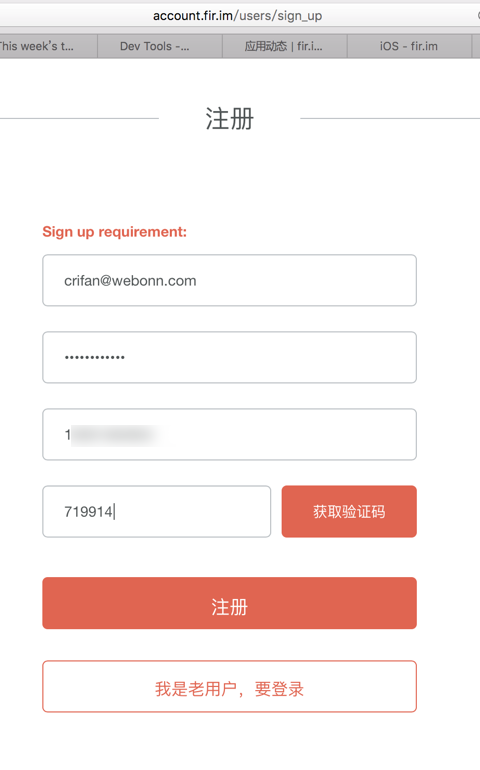

然后提示注册成功：

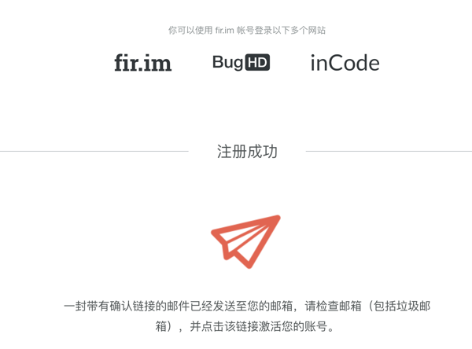

之后会收到确认邮件：

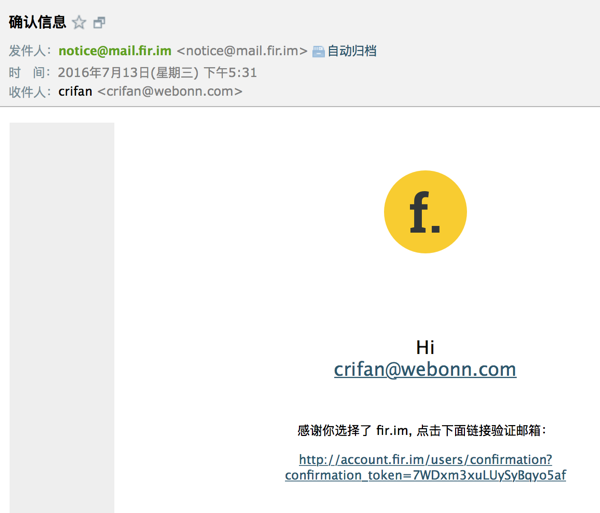

然后即可用新注册的账号去的登录了：

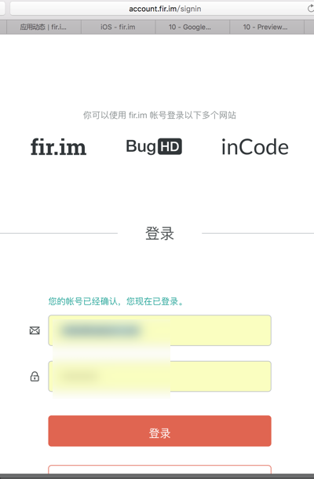

## 上传并发布app

之后，即可进入fir.im管理页面：

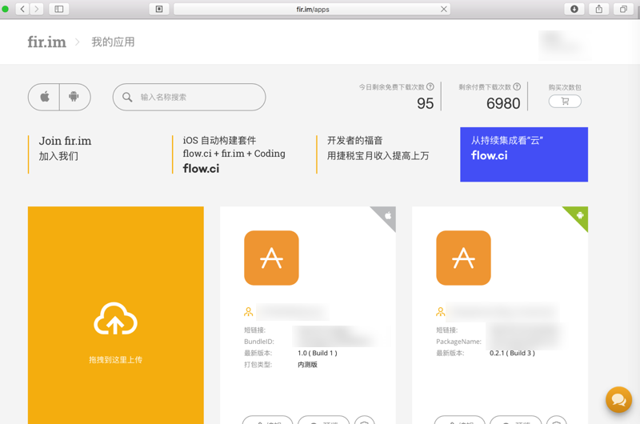

然后即可上传相应的app：

### iOS的app

比如此处上传的是iOS的app：

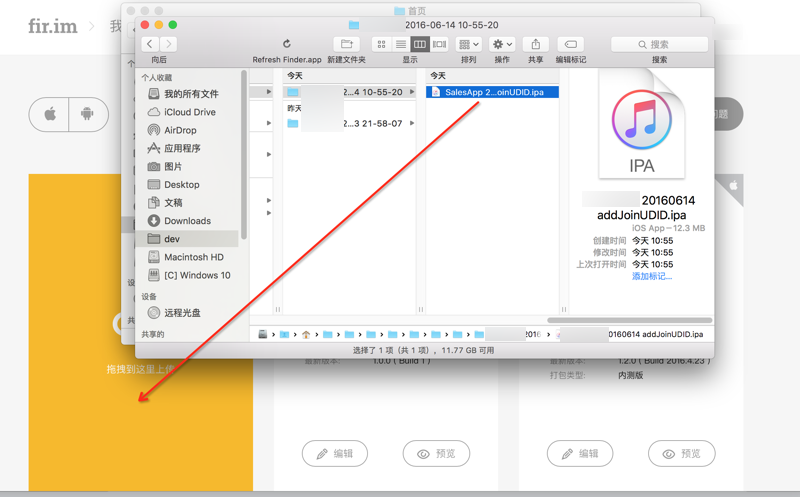

然后fir.im会自动检测出版本号，日期，版本类型等信息，接着输入对应的要发布的app的地址等信息：

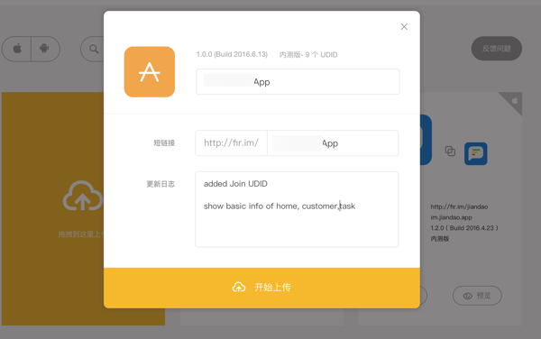

点击开始上传后，显示进度：

上传完毕后，即可自动跳转到后台管理页面，看到已上传的app的各种信息：

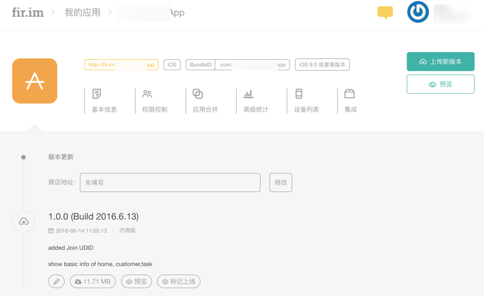

对于iOS来说，点击设备列表还可以看到已经注册的设备：

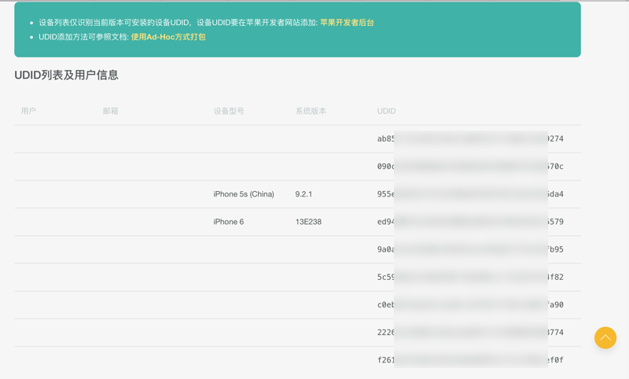

相应的，去打开对应的fir.im的地址：

XxxYyyApp – fir.im

http://fir.im/XxxYyyApp

后，可以看到对应的app下载页面的信息：

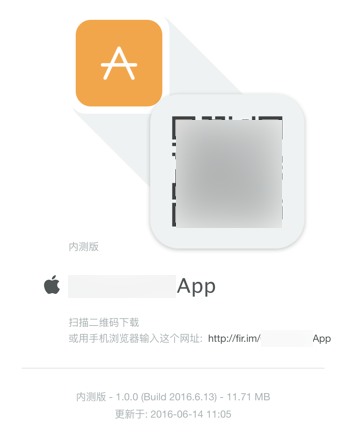

通过iPhone等去打开后，可以点击去下载并安装。

### Android的app

Android的app的上传和信息管理，也是类似的，就不重复介绍了。

列出部分截图供参考：

信息管理：

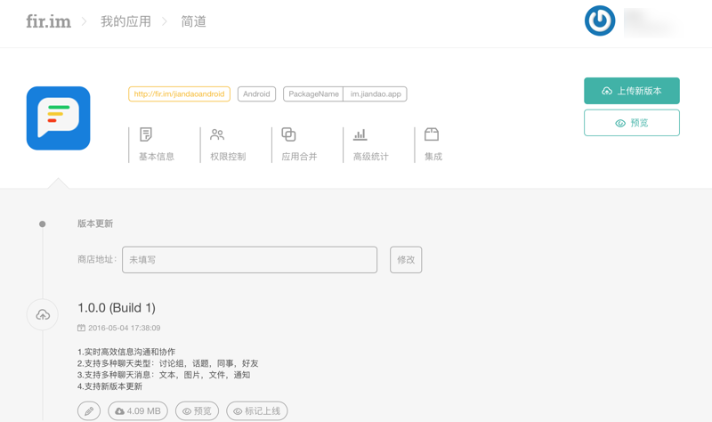

基本信息：

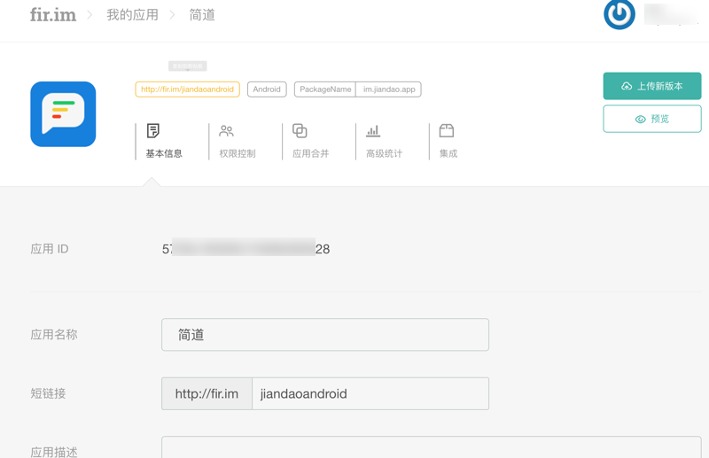

### 其他管理功能

此处再去看看其他一些额外的功能：

权限控制：

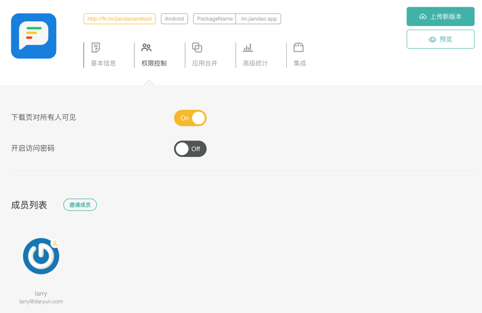

应用合并：

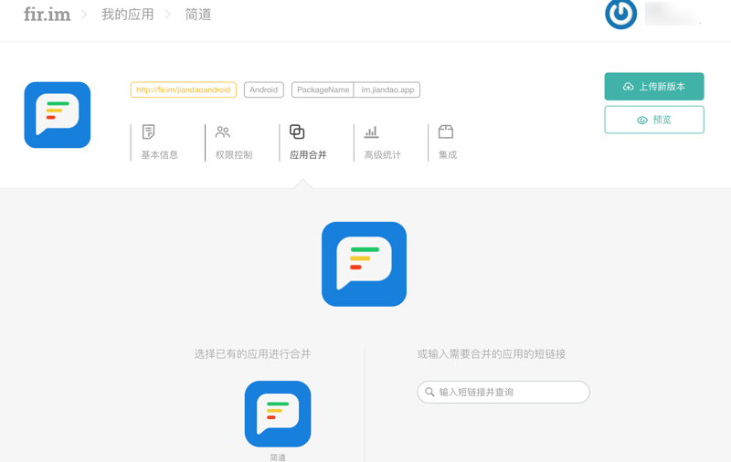

主要是用来实现，对于同一个app的不同平台，比如iOS和Android的话，可以合并在一起，便于管理：

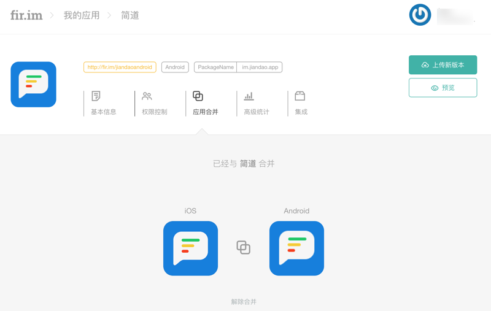

高级统计：

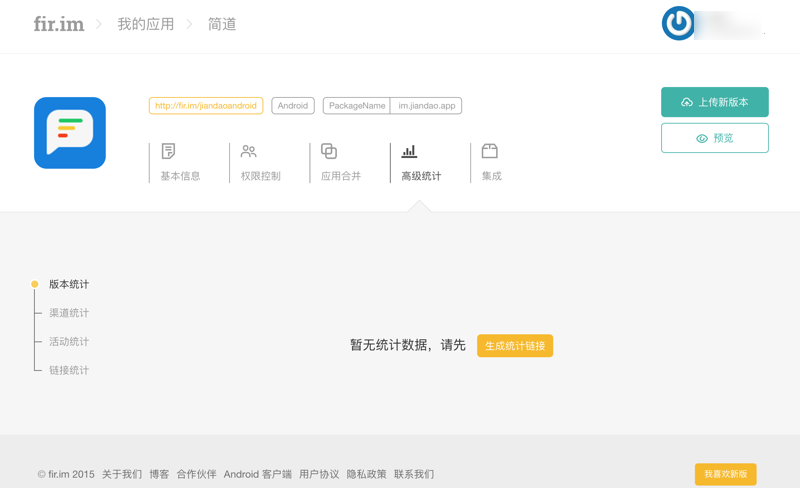

集成：

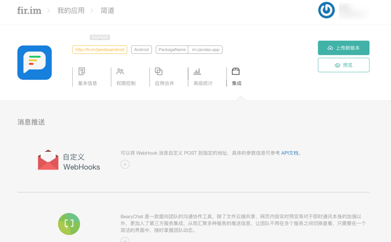

## 下载fir.im上的app

用手机端去打开对应页面，然后按照提示去点击下载即可。

> [!WARNING|title:iOS的错误：**无法下载应用程序 此时无法安装**]
> 
> iPhone等iOS设备中，有时候去下载fir.im上的app时，会提示出错：`无法下载应用程序 此时无法安装`
> 
> 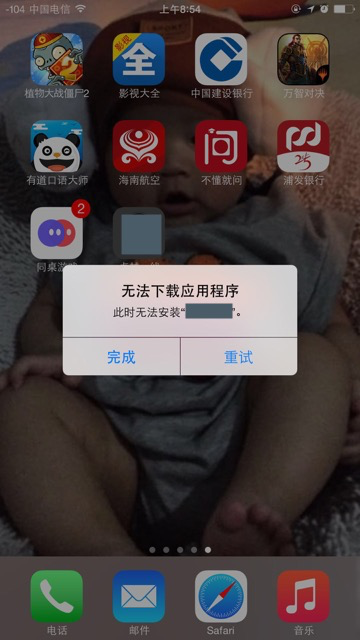
> 
> 其根本原因是：此APP开发时配置是最低只支持`iOS 9.0`，而此处iPhone系统版本是`iOS 8.3`，由于版本太低而无法安装
> 
> 吐槽：还是iPhone系统的提示不够智能，对于低版本的iOS系统，应该提示`已下载但无法安装，原因是当前系统版本太低`，这样用户就清楚错误原因了。
> 
> 对此问题，[fir.im 常见问题](http://blog.fir.im/faq01/)中也有总结：
> 
> `第三种：打包时选择支持的 iOS 系统版本过高，低于设置的系统版本的 iOS 设备无法安装
解决方法： 降低打包时支持的 iOS 系统的最低版本。`