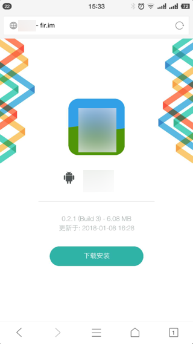
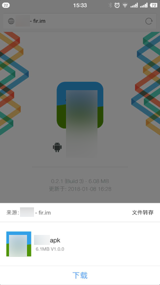
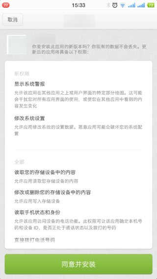
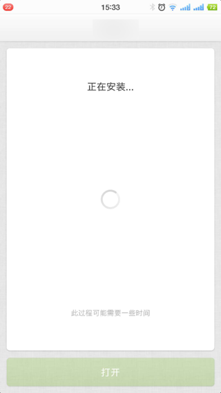
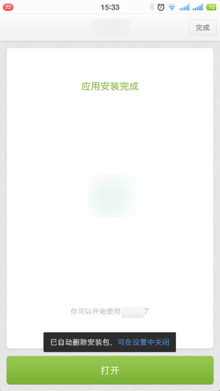
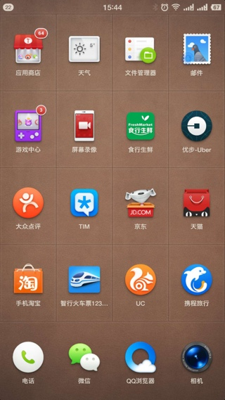
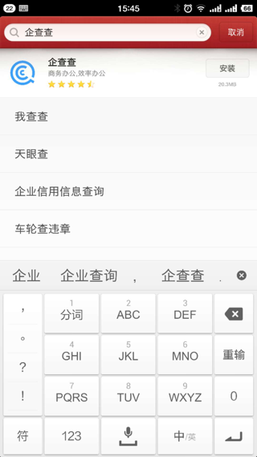
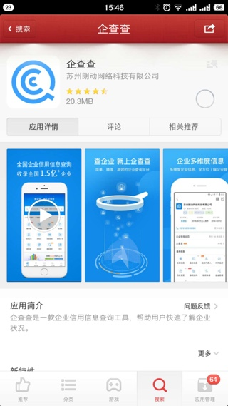
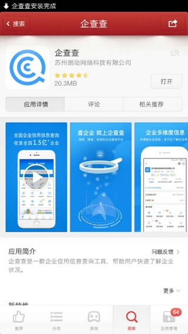
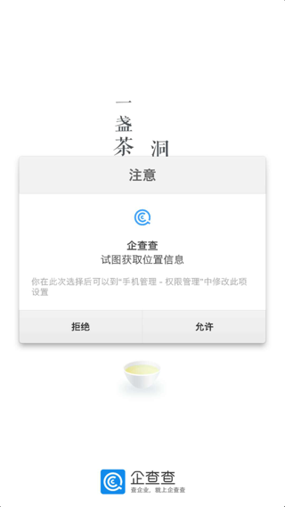

# Android的APP的安装和使用

相对于iOS的app来说，Android的app的下载和安装，限制比较少，都很方便：

只要能下载到对应的apk文件，就可以正常安装了。

## app托管平台：fir.im

比如把apk文件上传到fir.im上：

[Xxx - fir.im](https://fir.im/XxxAdrProd)

然后去下载：

点击下载按钮，去下载：

下载后，即可正常安装：

安装完毕后：

点击打开去打开APP。

## 各大应用市场

还有一种更方便的方式是：

在APP的应用市场去搜索并下载某个APP，即可。

比如：

我的锥子手机的应用市场是`应用商店`：

进去后，搜索自己要的app，比如：企查查

然后点击去安装即可：

然后点击打开：

即可打开APP：

