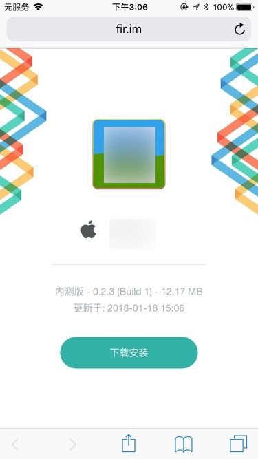
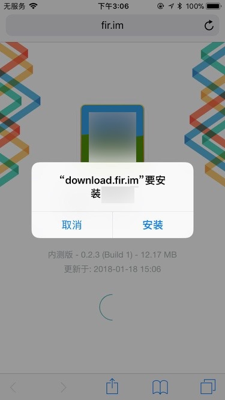
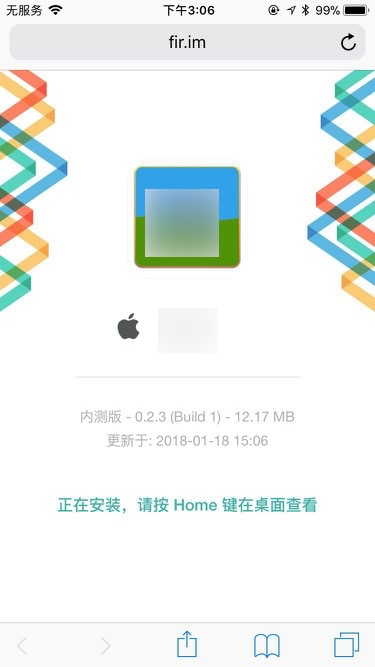
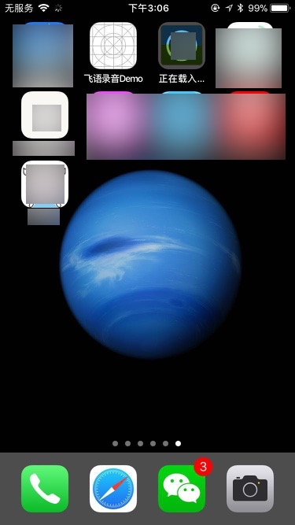
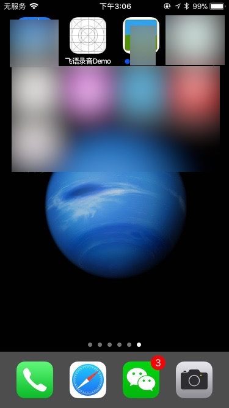
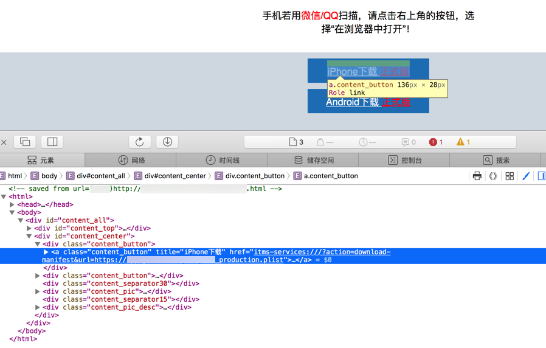
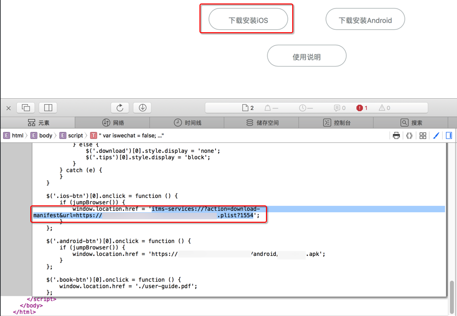

# iOS的APP的安装和使用

此处介绍iOS的APP的安装和使用的基本知识，以便于让iOS的APP开发和iOS的APP的使用人员，对于APP的不同版本，安装方法，有个基本的了解。

## iOS的APP的发布模式

如之前已经说的，其实有几种模式：

* AdHoc
* 企业版
  * OTA
* AppStore

下面分别介绍具体安装方式

## AdHoc

iOS打包AdHoc的目的是用于小范围的内部测试。

所以苹果要去打包AdHoc时，需要实现把相关的每个iOS设备的UDID，添加进去，打包后，只有加了UDID的iOS设备，才能安装AdHoc版本。

打包出来的也是ipa，上传到别的地方，即可下载。

### fir.im上的AdHoc版本

比如上传到fir.im上，比如：

xxx Production生产版 iOS

https://fir.im/XxxiOSProd

然后别人去用iPhone中的Safari去打开对应地址



然后点击下载按钮，会弹出提示：



> [!TIP|title:弹出提示会显示出域名]
>
> 对于此处弹出的提示中的`download.fir.im`，其实就是对应的之前提到的`plist`文件所在的`https`的服务器的域名/IP。

点击确定后，页面上会提示：`正在安装，请按Home键在桌面查看`：



然后iPhone中按Home健，回到桌面，找到正在安装的APP：



稍等片刻，即可安全完毕：



> [!WARNING|title:下载速度取决于实际情况]
>
> 对于此处的fir.im中的，是针对国内网络优化过的速度，所以下载很快的。
>
> 但是如果是其他地方的下载这种ipa的话，有时候会比较慢，往往是国外服务器的话，速度一般不是很理想。


## 企业版

### fir.im上的企业版

### 自己的公司官网的企业版的OTA版

其实也可以让自己的公司：

* 弄一个Web服务器
  * 把iOS打包出来的plist和ipa和logo图片，都放到对应的目录下
    * 就有了对应的plist文件的地址了
  * 然后
    * 再去弄一个HTML页面
      * 其中包含对应的：以`itms-services`开头的、`plist`结尾的地址
      * 再弄一个`按钮`button或（a的href）的`链接`，点击后去打开上面这个地址
    * 或者是iOS的app代码内部直接open以这个`itms-services`开头的、`plist`结尾的地址
      * 也会直接调用iOS的Safari去打开此地址
        * 从而实现自动下载ipa并安装的效果
        * 即：实现自动升级iOS的app的效果 = 不用打开浏览器而自动下载ipa并安装的效果
      * 相关参考代码：
        * `[[UIApplication sharedApplication]openURL:[NSURL URLWithString:[NSString stringWithFormat:@"itms-services://?action=download-manifest&url=https://xxx/yyy.plist"]]];`

#### https的Web服务器的ipa+plist+html页面实现发布企业版的OTA版的示例

##### 示例1: html中点击按钮跳转href的itms-services地址

如图：



其实内部都是一个`itms-services`开头的、`plist`结尾的地址，比如：

```bash
itms-services:///?action=download-manifest&url=https://xxx.yyy/zzz/aaa_production.plist
```

由此，点击对应的按钮后，即可直接或间接的调用iOS的Safari浏览器去解析并验证，通过后，才会直接去下载对应的ipa，安装对应的iOS的APP。

##### 示例2: html中点击按钮执行js去打开itms-services的地址

如图：



内部的web服务器中存放这对应的logo图片、android的apk文件、iOS的ipa文件等等：

```bash
[xxx@yyy html]$ pwd
/usr/share/nginx/html
[xxx@yyy html]$ ll
total 3864
-rwxrwxrwx. 1 root      root          537 May 31  2016 50x.html
drwxrwxrwx. 2 useradmin useradmin    4096 Jan 17 11:45 android
-rw-r--r--. 1 useradmin useradmin     661 Aug 15  2016 index1.html
drwxrwxrwx. 2 useradmin useradmin    4096 Jan 17 11:43 ios
drwxrwxrwx. 2 useradmin useradmin      85 Aug 10  2016 logo
-rwxrwxrwx. 1 useradmin useradmin 3369375 Aug 10  2016 manual.pdf
drwxrwxr-x. 2 useradmin useradmin      40 Jan 24  2017 test
-rwxrwxrwx. 1 useradmin useradmin  324069 Aug 10  2016 user-guide1.pdf
-rw-r--r--. 1 useradmin useradmin  172166 Aug 10  2016 user-guide.pdf
[xxx@yyy html]$ ll ios/manifest.plist 
-rw-r--r--. 1 useradmin useradmin 1111 Jan  9 05:46 ios/manifest.plist
[xxx@yyy html]$ ll ios/zzz.ipa 
-rw-r--r--. 1 useradmin useradmin 23998958 Jan  9 05:46 ios/zzz.ipa
[xxx@yyy html]$ ll logo/
total 36
-rwxrwxrwx. 1 useradmin useradmin 10474 Aug 10  2016 zzz_180x180.png
-rwxrwxrwx. 1 useradmin useradmin 19555 Jul 12  2016 zzz_512x512.png
-rwxrwxrwx. 1 useradmin useradmin  2537 Jul 12  2016 zzz_57x57.png
[xxx@yyy html]$ ll android/zzz.apk
-rw-r--r--. 1 useradmin useradmin 4773193 Jan 17 03:25 android/zzz.apk
```

## AppStore
